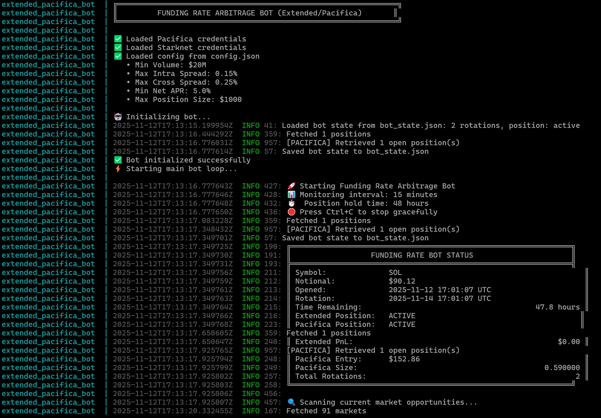

# Extended DEX and Pacifica Funding Rate Farming Bot (RUST)

**An autonomous trading bot for delta neutral funding rate farming between Extended DEX (Starknet) and Pacifica, plus a comprehensive Rust connector library for both exchanges.**

<p align="center">
  
</p>

---

## 🎁 Get Exclusive Referral Benefits

**Extended DEX** - [Sign up here](https://app.extended.exchange/join/FREQTRADE)
- 10% commission discount on first $50M volume

**Pacifica** - [Sign up here](https://app.pacifica.fi/) with referral codes (try the next one if a code is already used):
```
411J9J7CYNFZN3SX  2K7D40A9H53M2TJT  S1G3A2063Q7410BV
5KH0XDRD8BDGTBCT  S1YHDS2GWAJTWJ4M  7KB69JEC3BSA6GTR
```

---

## 📚 What is Delta Neutral Funding Rate Farming?

**Delta neutral funding rate farming** is a crypto trading strategy that earns passive income from funding rate differentials across exchanges while remaining market neutral.

### The Concept

Perpetual futures contracts use **funding rates** to keep their prices anchored to spot prices. Typically every 1 to 8 hours, depending on market sentiment:
- When longs outnumber shorts → longs **pay** shorts (positive funding)
- When shorts outnumber longs → shorts **pay** longs (negative funding)

Different exchanges often have different funding rates for the same asset. This creates an arbitrage opportunity.

### How It Works
1. **Identify the spread** - Find two exchanges where one pays significantly more than the other
2. **Open opposite positions** - Go SHORT on the exchange with positive funding, LONG on the exchange with negative funding
3. **Stay market neutral** - Because you're both long and short on the same asset, price movements cancel out
4. **Collect the difference** - Every 8 hours, you receive funding on one side and pay on the other, pocketing the spread

### Simple Example
**Scenario**: ETH funding rates differ across exchanges
- **Exchange A**: +15% APR funding rate (you go SHORT and pay)
- **Exchange B**: -20% APR funding rate (you go LONG and receive payment)
- **Your net profit**: 5% APR

Regardless of whether ETH goes up or down, your positions offset each other while you collect the funding spread.

### Why It Works
* ✅ **Market inefficiency** - Different exchanges have different trader ratios and market dynamics
* ✅ **No directional risk** - You're hedged against price movements
* ✅ **Predictable income** - Funding rates are published in advance
* ✅ **Scalable** - Works with any position size (subject to liquidity)

### This Bot's Strategy
This bot uses a **48-hour rotation cycle** with multiple objectives:

1. **Generate trading volume** - Regular position rotation creates volume across different assets, which can qualify for potential exchange airdrops and rewards programs
2. **Capture funding spreads** - Earn funding rate differentials as a bonus while maintaining positions
3. **Stay market neutral** - All positions are delta neutral, minimizing directional price risk

The 48-hour cycle is intentionally short - not to maximize funding returns (which would require longer holding periods), but to generate consistent volume across multiple markets while staying hedged. This approach is ideal for:
- Farming potential airdrops through volume, position holding time and activity
- Earning funding spreads as a secondary benefit

---

## Prerequisites

Before installation, ensure you have:

- **Rust 1.91+** - [Install Rust](https://rustup.rs/)
- **Python 3.8+** - Required for order signing
- **pip** - Python package manager
- **Extended DEX Account** - Create using referral link above
- **Pacifica Account** - Create using referral codes above
- **Funded Accounts** - Collateral on both exchanges (USDC recommended)
- **API Keys** - Generated from both exchange dashboards

---

## 🐳 Docker Quick Start

**The fastest way to get started!** Using Docker, you can run the bot without installing Rust or Python dependencies locally.

### Prerequisites
- [Docker](https://docs.docker.com/get-docker/) installed on your system
- Your `.env` file configured with API credentials (see Configuration section below)
- Your `config.json` configured with trading parameters

### Using Docker Compose

**Build and start the bot:**

```bash
# Build the Docker image
docker compose build

# Start the bot in background (persistent mode with -d flag)
docker compose up -d
```

The `-d` flag runs the container in detached mode (background), allowing it to run persistently.

**Manage the bot:**

```bash
# View live logs
docker compose logs -f

# Check status
docker compose ps

# Stop the bot
docker compose stop

# Stop and remove containers
docker compose down
```

### Docker Notes
- The bot runs as a non-root user (`botuser`) for security
- State is persisted in `bot_state.json` (mount it to preserve state across restarts)
- Health checks run every 30 seconds to ensure the bot is running
- All Python dependencies are included in the image

---

## 🤖 Autonomous Trading Bot

The main feature is a **fully automated funding rate farming bot** that:
- 🔍 Scans markets every 15 minutes for best opportunities
- 💰 Opens delta neutral positions (95% of available capital)
- ⏱️ Holds positions for 48 hours to capture funding payments
- 🔄 Automatically rotates to new opportunities
- 💾 Persists state for crash recovery
- 📊 Displays real-time PnL and position status

**Example**: Bot can run autonomously with small capital amounts to capture funding rate differentials. Results vary based on market conditions.

---

## Installation & Quick Start

### 1. Clone and Setup Repository

```bash
git clone <repository-url>
cd DELTRA_NEUTRAL_EXTENDED_PACIFICA_RUST
```

### 2. Install Python Dependencies

The bot requires Python for Starknet SNIP-12 order signing:

```bash
# Install dependencies
pip3 install -r requirements.txt

# Install Extended DEX Python SDK
cd python_sdk-starknet
pip3 install -e .
cd ..
```

**Why Python?** The Extended DEX uses SNIP-12 signatures which require the official Python SDK for compatibility. The Rust code calls a Python subprocess for signing.

### 3. Setup Credentials

**SECURITY NOTE:** Never commit your `.env` file to git. It's already in `.gitignore`.

Copy the example and fill in your credentials:

```bash
cp .env.example .env
```

Edit `.env` with your actual credentials:
```bash
# Extended DEX (from https://app.extended.exchange/)
API_KEY=your_api_key_here
STARK_PRIVATE=0xYOUR_PRIVATE_KEY
STARK_PUBLIC=0xYOUR_PUBLIC_KEY
VAULT_NUMBER=123456

# Pacifica (from https://app.pacifica.fi/)
SOL_WALLET=YourSolanaWalletAddress
API_PUBLIC=YourAgentWalletPublicKey
API_PRIVATE=YourAgentWalletPrivateKey
```

**How to get credentials:**
- **Extended DEX**: Dashboard → API Keys → Generate New Key
- **Pacifica**: Settings → API Management → Create Agent Wallet

### 4. Configure Trading Parameters

Edit `config.json` to set your risk parameters:
```json
{
  "filters": {
    "min_combined_volume_usd": 20000000,
    "max_intra_exchange_spread_pct": 0.15,
    "max_cross_exchange_spread_pct": 0.25,
    "min_net_apr_pct": 5.0
  },
  "trading": {
    "max_position_size_usd": 1000.0
  }
}
```

**Parameter Guide:**
- `min_combined_volume_usd`: Minimum 24h trading volume (lower = more opportunities, higher slippage risk)
- `max_intra_exchange_spread_pct`: Maximum bid-ask spread within each exchange (tighter = better execution)
- `max_cross_exchange_spread_pct`: Maximum price difference between exchanges (prevents arbitrage execution risk)
- `min_net_apr_pct`: Minimum net APR after costs (higher = fewer but more profitable opportunities)
- `max_position_size_usd`: Cap on position size per exchange (risk management)

### 5. Build and Run

**First, test the build:**
```bash
cargo build --release
```

**Run the bot:**
```bash
cargo run --release
```

Or run directly:
```bash
./target/release/extended_connector
```

**The bot will:**
1. ✅ Load credentials and configuration
2. 🔍 Scan for best opportunity immediately
3. 📊 Open delta neutral position (if opportunity found)
4. ⏱️ Monitor every 15 minutes and display status
5. 🔄 Automatically rotate to new opportunities after 48 hours

**To stop the bot:** Press `Ctrl+C` (will attempt to close positions gracefully)

## Features

### Autonomous Trading Bot
- ✅ **Delta Neutral Farming** - Simultaneous long/short positions across exchanges
- ✅ **Opportunity Scanner** - Real-time scanning with multi-stage filtering
- ✅ **Position Management** - Automated opening, monitoring, and closing
- ✅ **Emergency Exit** - Instant position closure tool with automatic retries
- ✅ **State Persistence** - JSON-based state for crash recovery (`bot_state.json`)
- ✅ **Retry Logic** - 5 attempts with exponential backoff for reliable execution
- ✅ **Monitoring** - 15-minute status updates with PnL tracking
- ✅ **Smart Sizing** - 95% capital allocation with lot size rounding

### Extended DEX (Starknet)
- ✅ **REST API Client** - Orderbooks, markets, positions, account balance
- ✅ **WebSocket Client** - Real-time bid/ask price streams
- ✅ **Order Placement** - Market and limit orders with SNIP-12 signing
- ✅ **Position Management** - Open, close, and monitor positions
- ✅ **Funding Rates** - Latest rates for all markets with formatted display

### Pacifica
- ✅ **Trading Client** - REST API for order placement and management
- ✅ **Funding Rates** - Hourly settlement rates with predictions
- ✅ **WebSocket Trading** - Low-latency trading operations
- ✅ **Orderbook Streaming** - Real-time orderbook updates
- ✅ **Position Management** - Monitor and close positions

### Farming Tools
- ✅ **Opportunity Finder** - Configurable filtering (volume, spreads, APR)
- ✅ **Parallel Fetching** - Concurrent API calls for fast scanning
- ✅ **Strategy Selection** - Automatic long/short direction optimization
- ✅ **APR Calculations** - Net annualized returns after spreads

### General
- ✅ **Type-Safe** - Strongly typed API responses with serde
- ✅ **Async/Await** - Built on tokio for high-performance operations
- ✅ **Error Handling** - Comprehensive error types with recovery
- ✅ **Logging** - Integrated tracing for debugging

## Installation

Add to your `Cargo.toml`:

```toml
[dependencies]
extended_connector = { path = "." }
tokio = { version = "1.42", features = ["full"] }
```

## Configuration

### config.json

```json
{
  "filters": {
    "min_combined_volume_usd": 50000000,      // $50M minimum 24h volume
    "max_intra_exchange_spread_pct": 0.15,    // 0.15% max spread within exchange
    "max_cross_exchange_spread_pct": 0.25,    // 0.25% max price difference
    "min_net_apr_pct": 5.0                    // 5% minimum net APR
  },
  "display": {
    "max_opportunities_shown": 10,
    "show_filtered_out_count": true
  },
  "performance": {
    "fetch_timeout_seconds": 30,
    "rate_limit_delay_ms": 100
  }
}
```

### Bot Behavior

- **Monitoring Interval**: 15 minutes
- **Position Hold Time**: 48 hours
- **Capital Allocation**: 95% of minimum available
- **Retry Attempts**: 5 with exponential backoff
- **Order Type**: Market orders for reliable execution

## Examples

### Run the Bot

```bash
# Main bot (default)
cargo run

# Or explicitly
cargo run --example funding_bot
```

### Scan Opportunities

```bash
# Find best opportunities without trading
cargo run --example scan_opportunities
```

### Extended DEX Examples

```bash
cargo run --example rest_example
cargo run --example websocket_example
cargo run --example funding_rates_example
cargo run --example check_positions
cargo run --example check_balance
```

### Pacifica Examples

```bash
cargo run --example pacifica_funding_rates
cargo run --example pacifica_check_positions
```

### Analysis Examples

```bash
cargo run --example funding_arbitrage
cargo run --example check_spreads
cargo run --example check_cross_spreads
```

### Emergency Tools

```bash
# Emergency exit - closes ALL positions immediately
cargo run --bin emergency_exit
```

**Emergency Exit**: Closes all open positions on both exchanges using the bot's proven close logic. Includes automatic retries and detailed status reporting. Use in case of market emergencies or when you need to exit all positions quickly.

## Library Usage

### REST API - Get Orderbook

```rust
use extended_connector::RestClient;

#[tokio::main]
async fn main() -> Result<(), Box<dyn std::error::Error>> {
    let client = RestClient::new_mainnet(None)?;
    let orderbook = client.get_orderbook("BTC-USD").await?;

    println!("Top bid: {:?}", orderbook.bid.first());
    println!("Top ask: {:?}", orderbook.ask.first());

    Ok(())
}
```

### WebSocket - Stream Prices

```rust
use extended_connector::WebSocketClient;

#[tokio::main]
async fn main() -> Result<(), Box<dyn std::error::Error>> {
    let client = WebSocketClient::new_mainnet(None);
    let mut rx = client.subscribe_orderbook("BTC-USD").await?;

    while let Some(bid_ask) = rx.recv().await {
        println!("{}", bid_ask);
    }

    Ok(())
}
```

### Opportunity Scanner

```rust
use extended_connector::{OpportunityFinder, OpportunityConfig, PacificaCredentials};

#[tokio::main]
async fn main() -> Result<(), Box<dyn std::error::Error>> {
    let config = OpportunityConfig::load("config.json")?;
    let pacifica_creds = PacificaCredentials::from_env()?;

    let finder = OpportunityFinder::new(
        Some("api_key".to_string()),
        pacifica_creds,
        config
    )?;

    let opportunities = finder.scan(Some("api_key".to_string())).await?;

    for opp in opportunities {
        println!("{}: {:.2}% APR", opp.symbol, opp.best_net_apr);
    }

    Ok(())
}
```

### Custom Bot

```rust
use extended_connector::{FundingBot, OpportunityConfig, PacificaCredentials};

#[tokio::main]
async fn main() -> Result<(), Box<dyn std::error::Error>> {
    dotenv::dotenv().ok();

    let api_key = std::env::var("API_KEY").ok();
    let pacifica_creds = PacificaCredentials::from_env()?;
    let config = OpportunityConfig::load("config.json")?;

    let mut bot = FundingBot::new(
        api_key.clone(),
        pacifica_creds,
        config,
        std::env::var("STARK_PRIVATE")?,
        std::env::var("STARK_PUBLIC")?,
        std::env::var("VAULT_NUMBER")?
    )?;

    bot.run(api_key).await?;
    Ok(())
}
```

## Architecture

```
src/
├── main.rs                # Bot entry point (cargo run)
├── lib.rs                 # Library exports
├── error.rs               # Error types
├── types.rs               # Core data structures
├── rest.rs                # Extended REST API client
├── websocket.rs           # Extended WebSocket client
├── signature.rs           # Order signing utilities
├── opportunity.rs         # Opportunity scanner
├── trading.rs             # Position execution logic
├── bot.rs                 # Bot orchestration & state
├── bin/                   # Standalone binaries
│   └── emergency_exit.rs  # Emergency position closer
├── snip12/                # SNIP-12 signing implementation
└── pacifica/              # Pacifica exchange integration
    ├── client.rs          # Orderbook WebSocket
    ├── trading.rs         # Trading REST API
    ├── ws_trading.rs      # Trading WebSocket
    └── types.rs           # Pacifica types

examples/
├── funding_bot.rs         # Main bot example
├── scan_opportunities.rs  # Opportunity scanner
├── rest_example.rs        # Extended REST examples
├── websocket_example.rs   # Extended WebSocket examples
└── ...                    # More examples

config.json                # Bot configuration
bot_state.json            # Bot state (auto-generated)
EMERGENCY_EXIT.txt        # Emergency command reference
```

## API Reference

### Bot Components

**OpportunityFinder**
- `new()` - Create finder with credentials and config
- `scan()` - Scan for opportunities with all filters
- `find_common_symbols()` - Markets available on both exchanges
- `fetch_volumes()` - Get 24h volumes in parallel

**FundingBot**
- `new()` - Create bot with credentials
- `run()` - Start main event loop (runs forever)
- `display_status()` - Show current position status
- `open_best_opportunity()` - Find and open position
- `close_current_position()` - Close active position

**Trading Functions**
- `open_delta_neutral_position()` - Open both legs with retry
- `close_delta_neutral_position()` - Close both positions
- `calculate_position_size()` - Size with lot rounding
- `retry_with_backoff()` - Exponential backoff wrapper

### RestClient

- `new_mainnet(api_key)` - Create client for mainnet
- `get_orderbook(market)` - Fetch full orderbook
- `get_bid_ask(market)` - Get best bid/ask
- `get_all_markets()` - List all markets
- `get_funding_rate(market)` - Get funding rate
- `get_all_funding_rates()` - All funding rates
- `get_positions(market)` - Get open positions
- `get_balance()` - Get account balance
- `place_market_order()` - Place market order
- `close_position()` - Close specific position

### PacificaTrading

- `new(creds)` - Create client with credentials
- `get_market_info()` - Get market specifications
- `get_funding_rate(symbol)` - Get funding rate
- `get_positions()` - Get open positions
- `place_market_order()` - Place market order
- `close_position()` - Close position

## Bot State

The bot maintains state in `bot_state.json`:

```json
{
  "current_position": {
    "symbol": "ETH",
    "extended_position": { "market": "ETH-USD", "size": "0.028", ... },
    "pacifica_position": { "symbol": "ETH", "amount": "0.028", ... },
    "opened_at": 1762449026,
    "target_notional_usd": 92.20
  },
  "last_rotation_time": 1762449026,
  "total_rotations": 1
}
```

This file enables crash recovery - if the bot restarts, it loads the previous state and continues monitoring.

## Testing

```bash
# Run bot in different terminal to monitor
cargo run

# Check bot state
cat bot_state.json

# Scan without trading
cargo run --example scan_opportunities

# Emergency close all positions (if needed)
cargo run --bin emergency_exit
```

**Testing Emergency Exit**: You can test the emergency exit tool by running it when you have an active position. It will close both positions and provide detailed status. For safety, always test with small positions first.

## Supported Markets

Common trading pairs:
- BTC-USD / BTC
- ETH-USD / ETH
- SOL-USD / SOL
- And 20+ more pairs available on both exchanges

## Dependencies

- `tokio` - Async runtime
- `tokio-tungstenite` - WebSocket client
- `reqwest` - HTTP client
- `serde` / `serde_json` - Serialization
- `tracing` - Logging framework
- `dotenv` - Environment variables
- `starknet-crypto` - SNIP-12 signing
- `ed25519-dalek` - Pacifica authentication

## Performance

- **Opportunity Scanning**: ~3-10 seconds for all markets
- **Order Execution**: ~1-2 seconds per exchange
- **Monitoring Interval**: 15 minutes
- **State Persistence**: <100ms

---

## Documentation

- [Extended API Documentation](https://docs.extended.exchange)
- [Extended Exchange](https://app.extended.exchange)
- [Pacifica API](https://api.pacifica.fi)
- [CLAUDE.md](./CLAUDE.md) - Development guide

## License

MIT

## Contributing

Contributions welcome! Please open an issue or PR.

---

## ⚠️ IMPORTANT SECURITY & RISK WARNINGS

**READ THIS BEFORE USING:**

- 🔴 **FINANCIAL RISK**: Trading cryptocurrency involves substantial risk of loss. Only use funds you can afford to lose.
- 🔴 **NO GUARANTEES**: Past performance does not guarantee future results. The bot can lose money.
- 🔴 **ALPHA SOFTWARE**: This is experimental software. Bugs may exist that could result in financial loss.
- 🔴 **API KEY SECURITY**: Never share your API keys or private keys. Store credentials securely.
- 🔴 **START SMALL**: Always test with minimal amounts first (e.g., $10-50) before scaling up.
- 🔴 **ACTIVE MONITORING**: Do not run unattended with significant capital. Monitor regularly.
- 🔴 **YOUR RESPONSIBILITY**: You are solely responsible for any financial losses incurred.

**RECOMMENDED APPROACH:**
1. Start with $10-50
2. Monitor actively for 1-2 weeks
3. Gradually increase position sizes only after confidence is established

---

## Disclaimer

This software is for educational purposes. Use at your own risk. Always test with small amounts first. No guarantees of profitability.
